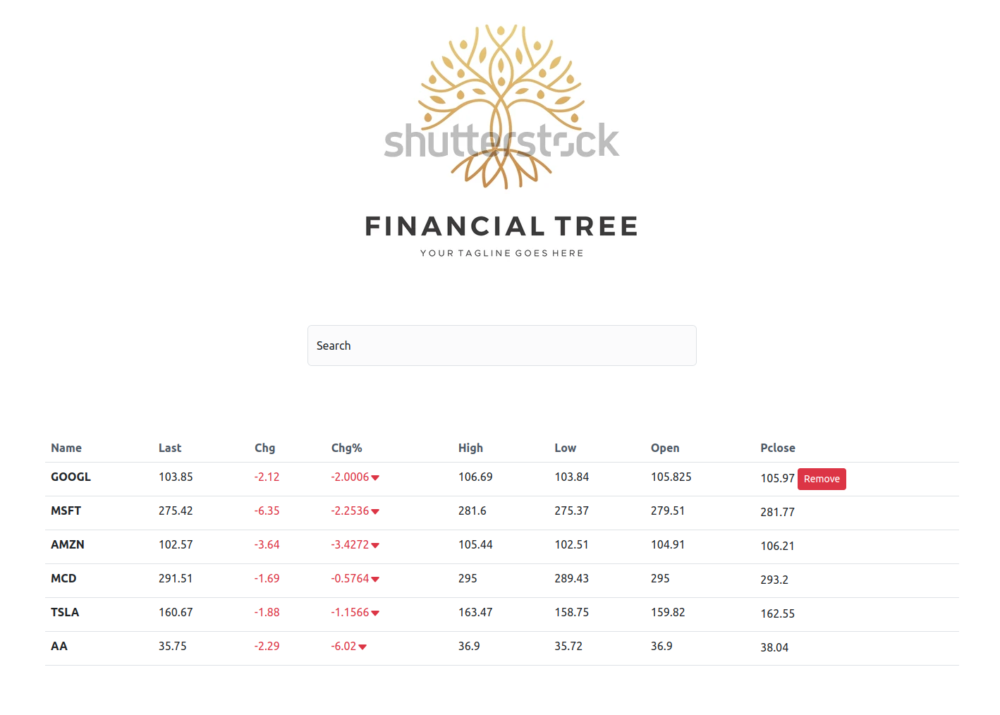
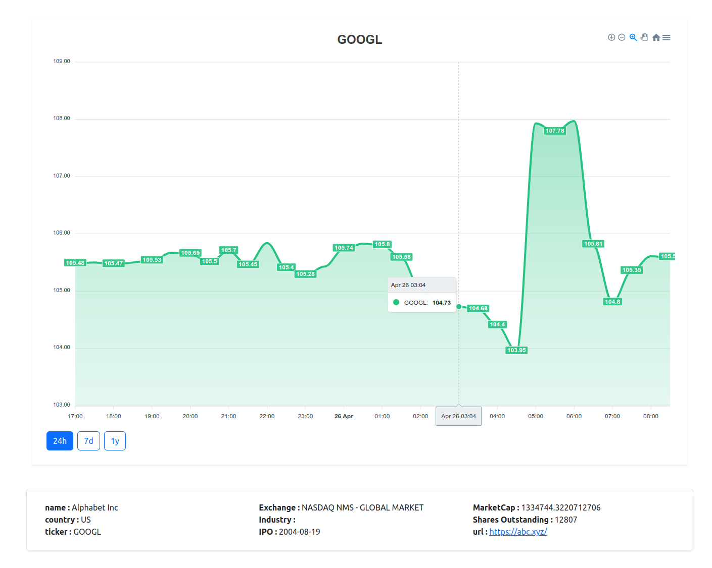
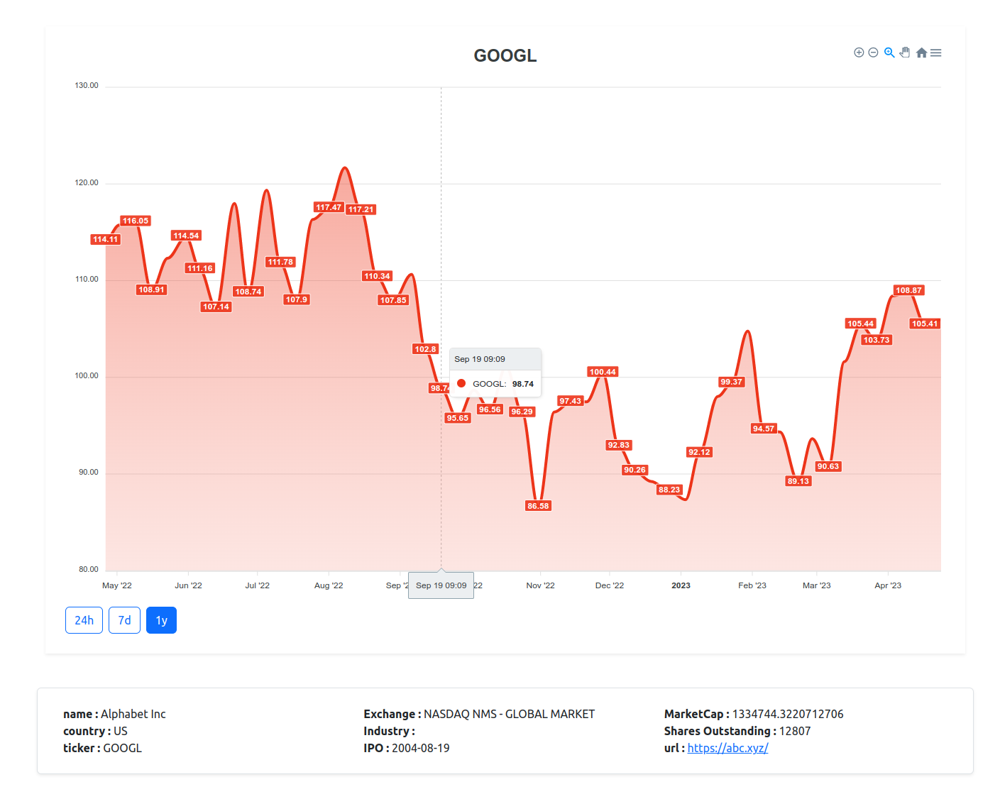

Stock Screen App using ReactJS

All the information about the stocks or companies are fetched from https://finnhub.io






To Execute, Follow this steps

```
git clone https://github.com/Sonjuan/stock-screen-app.git
```

make a file in our project src/apis/finnHub.js

example :
```
import axios from "axios"

const TOKEN = "your Finnhub Api Token"

export default axios.create({
    baseURL : "https://finnhub.io/api/v1",
    params : {
        token : TOKEN
    }
})
```

Execute

```
npm start
```